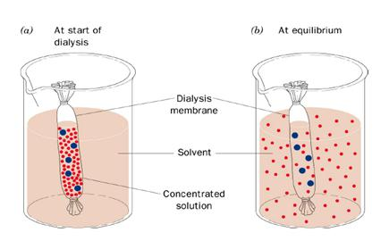

### Principle
 
&nbsp;

The diversity of the antibody-antigen interaction and our ability to manipulate the characteristics of this interaction has created many uses for antibodies and antibody fragments, both for immunochemical techniques within general research and for therapeutic and diagnostic applications. Ascites are intraperitoneal fluid from mice with peritoneal tumors that has been induced by injecting single cloned hybridoma cells. In mouse peritoneum, hybridoma   cells grow to high densities and secrete antibodies of interest. Ammonium sulfate precipitation is a method used to purify antibodies  by altering their solubility from ascites ,serum or hybridoma supernatant. It is a specific case of a more general technique known as salting out.

 
&nbsp;

 

To precipitate a dissolved protein, it is necessary to reduce the number of hydrogen bonds between solvent and the proteins. Addition of high concentration of salts removes water molecule from proteins thus decreasing the number of hydrogen bonds  and increasing the tendency of protein to precipitate. ‘Salting out’ of polypeptides occur at high salt concentration where the salt competes with the polar side chains of the protein for pairing with the water molecules  and where the salt reduces the effective volume of solvent. The solubility of proteins varies according to the ionic strength of the solution, and hence according to the salt concentration. Two distinct effects are observed: at low salt concentrations, the solubility of the protein increases with increasing salt concentration (i.e. increasing ionic strength), an effect termed ‘salting in’. As the salt concentration (ionic strength) is increased further, the solubility of the protein begins to decrease. At sufficiently high ionic strength, the protein will be almost completely precipitated from the solution (salting out).Since proteins differ markedly in their solubilities at high ionic strength ; salting-out is a very useful procedure to assist in the purification of a given protein.

  
&nbsp;

Antibody precipitation can be carried out using a variety of agents ranging from distilled water to complex glycols and specialized acids. A more popular technique for immunoglobin isolation is salt precipitation. Immunoglobulins precipitate out  of either sodium or ammonium sulphate especially when non refined fractions of immunoglobulin are required. Further refinement can be done by ion exchange or other forms of chromatographic technique.

 
&nbsp;

 

Precipitation using ammonium sulphate is one of the oldest method and widely applicable approach  for partial purification of antibodies. In solution, a large number of water molecules  are bound to the sulphate ion reducing the amount of water available to interact with the protein molecules. At a particular concentration of ( NH4)2SO4, an insufficient quantity of unbound water will remain to keep a given protein species in solution, resulting in precipitation. A saturated solution of ammonium sulphate is added to serum or ascites to precipitate the antibody. Ammonium sulphate is useful for  polyclonal and monoclonal IgG isolation. A solution with 35% saturated will produce a pure IgG precipitation, but not all IgG will be contaminated with other proteins(eg., albumin) .Precipitation at  45% saturated produces an ideal starting  material for other purification techniques. Sodium sulphate is used for rabbit or human  polyclonal IgG. Caprylic acid is used for polyclonal and monoclonal IgG  antibody. Purification is achieved by  precipitation of non- IgG proteins. Different species require different final concentration of  caprylic acid: human and horse serum 6.1% ;goat serum requires 8.0%; and rabbit serum requires 8.2%. Polyethylene is  useful for both polyclonal and monoclonal antibodies. The disadvantage of PEG (Polyethylene glycol ) is that it is not easily removed from protein solutions.

&nbsp;

 

Amount of ammonium sulphate required to precipitate a given protein will depend mainly on the surface charge, the surface distribution of polar side chains , and the size of the polypeptide,  as well as the pH and the temperature of the solution. Immunoglobulins precipitate at 40-50% ammonium sulphate saturation depending on species and sub class. The desired saturation  is brought  about  either by addition of solid ammonium sulphate or by addition of a saturated solution. Although the use of  solid  salt reduces the final volume, this method has a number of disadvantages. Prolonged stirring, required to solubilize  the salt can lead to denaturation of protein in the solution at the surface/air interface. Localized high concentration of ammonium sulphate salt may cause unwanted proteins to precipitate. Since ammonium sulphate is slightly acidic in solution, pH of the protein solution requires  constant monitoring  and  adjustment  if solid salt is added and is advisable to add  a buffered solution of  saturated ammonium sulphate. A saturated ammonium sulphate  is  considered to be 100% and the ascites or serums are mixed with an equal volume of saturated ammonium sulphate to give a 50% solution.

 

Calculate the volume of ammonium sulphate required for precipitation using the following equation.

&nbsp;

Where X is the volume of saturated ammonium sulphate, Y is the desired final concentration of ammonium sulphate ( expressed as a decimal fraction, where 1 =100%), and V is an initial volume of sample undergoing the salt cut.

 
 
&nbsp;

 

Ammonium sulphate is found to stabilize proteins in solution by raising the midpoint temperature at which the protein can be unfolded which is due to the result of interaction of salt with the structure of water. Precipitated immunoglobulins can be solubilized in a minimal volume of buffer. Proteins of very high molecular weight usually precipitate below 25% ammonium sulphate saturation. Crude extracts may be subjected to fractionation in three stages : 0 to 30%,30 to 60%, and 60 to 80% ammonium sulphate saturation. Precipitation of proteins by water miscible solvents such as alcohol or acetone is another technique but denaturation of protein may occur at room temperature. Complete precipitation occurs within  3-8 hours at 40C.The precipitate is collected  by centrifugation, solubilized in  an appropriate buffer for storage at -80 0 C or dialyzed to remove residual salt prior to further purification. Although fractionation with ammonium sulphate provides  a convenient method , it should not be used as a single step purification , since the precipitated proteins contains considerable amount of contaminating proteins. Ammonium sulphate can be removed by dialysis of protein solution against large volumes of desired buffer. Since it is a time consuming process the alternative methods employed to remove small molecule from proteins are gel filtration or gel permeation chromatography.

 
 
&nbsp;

 

### Dialysis
 

 
&nbsp;

 

Dialysis Tubing is a type of semi- or partially permeable membrane tubing  made from regenerated cellulose or cellophane. The solution to be dialyzed is placed in a sealed dialysis membrane and immersed in a selected buffer; small solute molecules then equilibrate between the sample and the dialysate. Concomitant with the movement of small solutes across the membrane, however, is the movement of solvent in the opposite direction. This can result in some sample dilution (usually <50%). It is used in clinical circumstances to ensure a filtered flow of molecules, preventing the flow of larger solute molecules.

&nbsp;

Dialysis membranes are available in a number of thicknesses and pore sizes. Thicker membranes are tougher, but restrict solute flow and reach equilibrium more slowly. Pore size is defined by “molecular weight cut-off” (MWCO) i.e., the size of the smallest particle that cannot penetrate the membrane. Knowledge of the precise MWCO is usually not required; however, it is necessary only to use a membrane with a pore size that is much smaller than the macromolecule of interest. For most plasmid and protein dialyses, a MWCO of 12,000 to 14,000 is appropriate, whereas a MWCO of 3500, 2000, or even 1000 is appropriate for peptides. Most dialysis membranes are made of derivatives of cellulose. They come in a wide variety of MWCO values, ranging from 500 to 500,000.

 
&nbsp;

 
 

### Selection and Preparation of Dialysis Membrane:

 
&nbsp;

 
 

Remove membrane from the roll and cut into usable lengths - Always use gloves to handle dialysis membrane, as it is susceptible to a number of cellulolytic microorganisms. Membrane is available as sheets or preformed tubing.
Wet membrane and boil it for several minutes in a large excess of 10 mM sodium bicarbonate.
Boil several minutes in 10 mM Na2EDTA - Boiling speeds up the treatment process but is not necessary. A 30-min soak with some agitation can substitute for the boiling step.
Wash several times in distilled water.
Store at 4°C in 20% to 50% ethanol to prevent growth of cellulolytic microorganisms.
 

 
&nbsp;

 

The dialysis tubing can be used directly from the dry roll. After wetting the tubing in water, clamp its end using a dialysis clip. Sample can be loaded into the tubing. The tubing is closed by means of the clip. High concentration of salt in the sample will cause buffer to enter the tubing before salt can exit, resulting in volume increase in the tubing. If there is a high solute concentration of salt in the tubing, space should be left for expansion. High pressure in the tubing might result in leakage through the clamped portion. Place the loaded dialysis tubing in a beaker containing dialysis buffer and a magnetic stirrer.

 
 
&nbsp;

 

A magnetic stirrer or magnetic mixer is a laboratory device that employs a rotating magnetic field to cause a stir bar  immersed in a liquid to spin very quickly, thus stirring it. A magnetic stirrer is an instrument meant for creating rotating magnetic field. It consists of small bar magnet and a stand or plate containing rotating magnet. The bar magnet is normally coated with plastic whereas, plate contains rotating magnet. The rotating magnet is responsible for creating rotating magnetic field.
